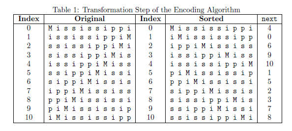

# File Compressor

Encoding and decoding schemes are used in a wide variety of applications, such as in music or video streaming,
data communications, storage systems (e.g., on CDs, DVDs, RAID arrays), among many others. In a *fixed-length encoding* each character is assigned a bit string of the same length. 

In this project I implemented a *variable-length encoding and decoding scheme*, and ran experiments to evaluate the effectiveness of the the scheme for __*file compression*__ , in addition to the effciency of my algorithms.

## Input to the encoding algorithm 
The input to the encoding algorithm is a normal text (`.txt`) file that the user wishes to encode. The encoding algorithm has one input parameter taken from the command line: It is a keyword indicating the sorting algorithm to use. 

## Encoding Algorithm
Given a normal English text file, for each line of the file:
  * Transform the line into a form that is more amenable to compression. The transformation rearranges
the characters in the input into many clusters of repeated characters, in a way that it is possible to
recover the original input.
  * Output the compressed form of the transformed line. To transform a line of text, treat the line as a string of length N. First, compute (and store) every cyclic shift of the string, shifting to the left by one character. Then sort the N cyclic shifts in lexicographic order according to the ASCII code. Note the ordering of characters in the ASCII code.

Table 1 shows the transformation step for the example string `Mississippi`, of length `N = 11`. Under
Original, rows with index 0 ... 10 show the cyclic shift of the string to the left by as many characters, e.g.,
at index 5 is the string shifted cyclically to the left by 5 characters. Under Sorted, all N cyclic shifts of the
string are sorted. (The `next` column is used in decoding, so it is discussed in Decoding Algorithm sections)

#### The output of the encoding algorithm
The compressed output for a string consists of two lines:
  * The index of the row in which the original string appears in the Sorted column.
  * Form a string last consisting of the last character of each Sorted string. In this string, which is some permutation of the original string, characters form clusters of characters of size one or more. To encode last step through the string from left to right processing the clusters: For each cluster, output the cluster size, followed by the character in the cluster. 
`0`  
`1 i 1 p 2 s 1 M 1 p 1 i 2 s 2 i`

## Decoding Algorithm
To recover the original string. There are three steps in the recovery:
  * Read the integer giving the index of the row in which the original string appears in the Sorted column.
  * Recover the string last.
  * Using the index, last, and knowledge of the next column, recover the original string.
  
## Running the program from `cmd` line
 * `>> encode insertion <ex1.txt >enex1.txt // encoding using INSERTION SORT algoritghm`  
 * `>> encode merge <ex2.txt >enex2.txt // encoding using MERGE SORT algoritghm `
